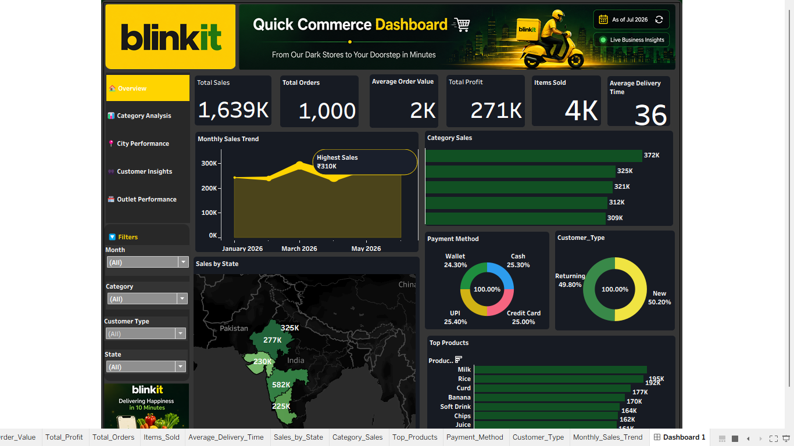

# 🛒 Blinkit Tableau Sales Dashboard

## 📌 Project Overview
This project is an interactive Tableau dashboard created to analyze Blinkit sales performance. It provides insights into sales, profit, orders, customer behavior, payment methods, product performance, and regional sales.

---

## 📊 Dashboard Preview

---

## 🚀 Key Features

- 📈 Total Sales KPI
- 🛍️ Total Orders
- 💰 Total Profit
- 📦 Items Sold
- 🚚 Average Delivery Time
- 📅 Monthly Sales Trend
- 🥦 Category-wise Sales Analysis
- 🗺️ State-wise Sales Map
- 💳 Payment Method Distribution
- 👥 Customer Type Analysis
- 🏆 Top Products
- 🎛️ Interactive Filters

---

## 🛠️ Tools Used

- Tableau
- Microsoft Excel
- CSV Dataset

---

## 📂 Files Included

- `Blinkit_Sales_Dashboard.twb` – Tableau workbook
- `Blinkit_Dataset.csv` – Dataset
- `Blinkit_Dashboard.png` – Dashboard screenshot

---

## 📈 Insights

- Highest monthly sales reached **₹310K**.
- Grocery category generated the highest revenue.
- New and Returning customers are almost equally distributed.
- UPI, Cash, Credit Card, and Wallet payments are nearly balanced.
- Sales performance varies significantly across states.

---

## 👩‍💻 Author

**Riya Verma**

Aspiring Data Analyst

GitHub: https://github.com/RiyaVerma-13
